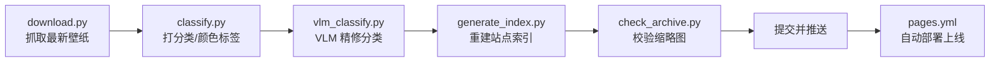

# Bing 每日壁纸归档

自动归档必应（Bing）每日壁纸的轻量站点：每日抓取 → 自动打标签 → 生成缩略图 → GitHub Pages 展示。支持分类/颜色筛选、全文搜索、原图查看、批量打包下载。

🌐 **在线地址**：<https://ygnstudio.github.io/bing_wallpaper_archive/>

## 功能特性

- **每日自动更新**：GitHub Actions 每天 09:00（北京时间）自动抓取 Bing 最新壁纸，全自动、零人工。
- **分类筛选**：10 类 —— 人物 / 动物 / 美食 / 交通 / 建筑 / 太空 / 植物 / 抽象艺术 / 风景 / 其他。
- **颜色筛选**：10 色 —— 蓝 / 绿 / 红 / 黄 / 橙 / 紫 / 粉 / 棕 / 灰白 / 多彩，基于缩略图主色自动计算。
- **多维检索**：按标题 / 版权 / 日期全文搜索，年份、月份、分类、颜色下拉可任意叠加。
- **原图查看**：灯箱查看原图，支持 1080p / UHD 4K 分辨率切换、复制原图直链。
- **批量下载**：勾选 2 张及以上打包成 ZIP（纯前端实现，无压缩、免第三方库）；选 1 张则直接下载原图。
- **纯静态、零后端**：前端原生 HTML/CSS/JS，托管 GitHub Pages，无数据库、无框架、无服务端。

## 数据规模

- 收录 **2016-03-05 至今** 共 **3820 张**壁纸（其中 3818 张含缩略图）。
- **每日自动更新**：每天由 GitHub Actions 抓取最新壁纸入库，总量持续增长。
- 数据源：Bing 官方 `HPImageArchive` API（`mkt=zh-CN`）。

## 目录结构

```
bing_wallpaper_archive/
├── data/                  # 数据
│   ├── metadata.json      #   全量元数据（标题/版权/链接/分类/颜色）
│   └── index.json         #   站点索引（前端直接读取）
├── thumbnails/            # 缩略图（按 YYYY/MM/ 存放，480×270）
├── site/                  # 前端（原生 HTML/CSS/JS）
├── scripts/               # Python 脚本
│   ├── download.py        #   每日抓取最新壁纸
│   ├── classify.py        #   分类 + 颜色打标（关键词启发式 + 主色提取）
│   ├── vlm_classify.py    #   VLM 视觉语言模型分类（Qwen2-VL，图文一起读）
│   ├── generate_index.py  #   重建 index.json
│   ├── update_readme_stats.py # 自动同步 README 数据规模
│   └── check_archive.py   #   校验缩略图完整性
└── .github/workflows/     # GitHub Actions
    ├── update.yml         #   每日自动更新
    └── pages.yml          #   Pages 部署
```

## 自动更新流程

每天 09:00（北京时间）由 GitHub Actions 触发：



## 分类与颜色是怎么来的

- **分类**：两层流水线 ——
  - 关键词启发式（`classify.py`，最长命中 + 单字词过滤地名误伤），约 90% 准确率。
  - VLM 视觉语言模型（`vlm_classify.py`，Qwen2-VL-2B，图文一起读），每日 CI 自动跑最新图，将难例（标题/版权含动物词但图是建筑、植物词但图是桥等语义冲突）修对。
  - 历史 3820 条由一次性回填校准，剩余「其他」约 16 条（极难判/无明显主体）。
- **颜色**：用 Pillow 中位切分量化出主色，再按色相 / 饱和度 / 明度归到 9 色 + 多彩。这是纯像素算法，稳定可复现。

## License

详见 [LICENSE](LICENSE)。壁纸图片版权归原作者与 Bing 所有，本项目仅用于归档与学习。
