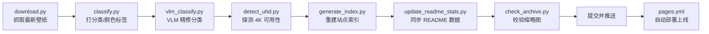

# Bing 每日壁纸归档

自动归档必应（Bing）每日壁纸的轻量站点：每日抓取 → 自动打标签 → 生成缩略图 → GitHub Pages 展示。支持分类/颜色筛选、全文搜索、原图查看、批量打包下载。

🌐 **在线地址**：<https://ygnstudio.github.io/bing_wallpaper_archive/>

## 功能特性

- **每日自动更新**：GitHub Actions 每四小时检查一次，计划在北京时间 00:37、04:37、08:37、12:37、16:37、20:37 运行；实际触发可能延迟。
- **分类筛选**：10 类 —— 人物 / 动物 / 美食 / 交通 / 建筑 / 太空 / 植物 / 抽象艺术 / 风景 / 其他。
- **颜色筛选**：10 色 —— 蓝 / 绿 / 红 / 黄 / 橙 / 紫 / 粉 / 棕 / 灰白 / 多彩，基于缩略图主色自动计算。
- **多维检索**：按标题 / 版权 / 日期全文搜索，年份、月份、分类、颜色下拉可任意叠加。
- **原图查看**：灯箱查看原图，支持 1080p / UHD 4K 分辨率切换、复制原图直链。
- **批量下载**：勾选 2 张及以上打包成 ZIP（纯前端实现，无压缩、免第三方库）；选 1 张则直接下载原图。
- **纯静态、零后端**：前端原生 HTML/CSS/JS，托管 GitHub Pages，无数据库、无框架、无服务端。

## 数据规模

- 收录 **2016-03-05 至今** 共 **3868 张**壁纸（其中 3868 张含缩略图）。
- **每日自动更新**：每天由 GitHub Actions 抓取最新壁纸入库，总量持续增长。
- 数据源：Bing 官方 `HPImageArchive` API（`mkt=zh-CN`）。

## 目录结构

```
bing_wallpaper_archive/
├── data/                      # 数据
│   ├── metadata.json          #   全量元数据（标题/版权/url/urlbase/uhd/分类/颜色）
│   ├── index.json             #   轻量站点索引（前端首屏直接读取）
│   └── YYYY.json              #   按年份存放的完整数据（懒加载）
├── thumbnails/                # 缩略图（按 YYYY/MM/ 存放，480×270，webp）
├── site/                      # 前端源码（原生 HTML/CSS/JS）
│   ├── index.html / about.html
│   └── assets/                #   JS/CSS 模块、Service Worker、Web Worker
├── scripts/                   # Python / Node 脚本
│   ├── download.py            #   检查最近八条并补齐缺失缩略图
│   ├── classify.py            #   关键词分类 + Pillow 主色提取
│   ├── vlm_classify.py        #   Qwen2-VL 视觉语言模型精修分类
│   ├── generate_index.py      #   由 metadata.json 重建 index.json
│   ├── detect_uhd.py          #   4K（UHD）可用性探测
│   ├── validate.py            #   JSON Schema 数据校验
│   ├── check_archive.py       #   缩略图完整性检查
│   ├── convert_thumbnails.py  #   jpg → webp 批量转换（外部数据导入时用）
│   ├── update_readme_stats.py #   自动同步 README 数据规模
│   └── build.js               #   Rollup 构建站点到 dist/
├── schemas/                   # JSON Schema
│   ├── metadata.schema.json
│   └── index.schema.json
├── tests/                     # 单元测试
│   └── unit.test.js
└── .github/workflows/         # GitHub Actions
    ├── update.yml             #   每日自动更新
    ├── detect-uhd.yml         #   每周 4K 可用性探测
    └── pages.yml              #   Pages 构建部署
```

## 自动更新流程

每天 09:00（北京时间）由 GitHub Actions 触发：


```mermaid
flowchart LR
    A[download.py<br>抓取最新壁纸] --> B[classify.py<br>打分类/颜色标签]
    B --> B2[vlm_classify.py<br>VLM 精修分类]
    B2 --> D[detect_uhd.py<br>探测 4K 可用性]
    D --> C[generate_index.py<br>重建站点索引]
    C --> E[update_readme_stats.py<br>同步 README 数据]
    E --> F[check_archive.py<br>校验缩略图]
    F --> G[提交并推送]
    G --> H[pages.yml<br>自动部署上线]
```

`detect-uhd.yml` 仅在需要手动强制重探测全量图片时使用，日常增量由 `update.yml` 自动兜底。

## 分类与颜色是怎么来的

- **分类**：两层流水线 ——
  - 关键词启发式（`classify.py`，最长命中 + 单字词过滤地名误伤），约 90% 准确率。
  - VLM 视觉语言模型（`vlm_classify.py`，Qwen2-VL-2B，图文一起读），每日 CI 自动跑最新图，将难例（标题/版权含动物词但图是建筑、植物词但图是桥等语义冲突）修对。
  - 历史数据已由一次性回填校准，剩余少量「其他」（极难判/无明显主体）。
- **颜色**：用 Pillow 中位切分量化出主色，再按色相 / 饱和度 / 明度归到 9 色 + 多彩。这是纯像素算法，稳定可复现。

## License

详见 [LICENSE](LICENSE)。壁纸图片版权归原作者与 Bing 所有，本项目仅用于归档与学习。

### 归档日期与本地刷新

每日抓取检查 Bing 最近八张壁纸，以官方 `startdate` 作为归档日期，不使用抓取当天日期，也不根据 `fullstartdate` 推算或平移日期。日期缺失或无效时中止更新，避免写入猜测日期。已有图片的日期、分类与颜色保持不变。

本地预览使用构建时的数据副本，不会自动跟随远端主分支更新。更新本地数据后需重新构建：

```sh
python3 scripts/download.py
python3 scripts/classify.py
python3 scripts/generate_index.py
python3 scripts/update_readme_stats.py
python3 scripts/check_archive.py
npm run build
```

首次运行需安装 `requirements.txt`。官方日期保留、重复同步及失败保护可用 `npm run test:archive` 验证。

### 更新工作流

先用 `python3 scripts/download.py --check` 检查官方最近八条记录和全库缺失、空文件缩略图。没有新增且图片完整时跳过图片依赖、下载、分类、模型和重建；新增时模型一次处理全部新增日期，纯缺图修复不重新运行模型。Bing 元数据与图片网络请求最多尝试三次；仍失败则任务报错，不提交不完整数据。流程串行运行，避免重复任务相互覆盖。

每次成功检查的 `.archive-update/report.json` 包含检查时间（UTC）、官方归档日期、原始 `fullstartdate` / `enddate`、新增和缺图列表，作为 Actions artifact 保存 90 天。`data/first-seen.json` 持久记录每张图首次被本检查器观察到的时间，并注明当时是否已经在库；首次启用时的历史条目不会伪装成刚发布。**首次观察时间不是 Bing 发布时间。** 无新数据时只上传检查报告；首次新增观察记录可单独提交，不触发 Pages 部署。

本地可用 `python3 scripts/download.py --apply-report .archive-update/report.json` 处理已检查的待办，再按前述命令分类、重建和校验。工作流使用 `--dates-file .archive-update/report.json` 让视觉模型处理全部新图。缺失缩略图字段、空文件、文件不存在或缺失日期都会使校验失败。

### Cloudflare Pages

站点支持 Cloudflare Pages 根目录部署，并保留 GitHub Pages 项目路径作为备用。配置使用 `None` / `main` / `npm run build` / `dist`，通过 `SITE_URL` 设置正式地址。详见 [部署、验证与回滚说明](docs/cloudflare-pages.md)。
